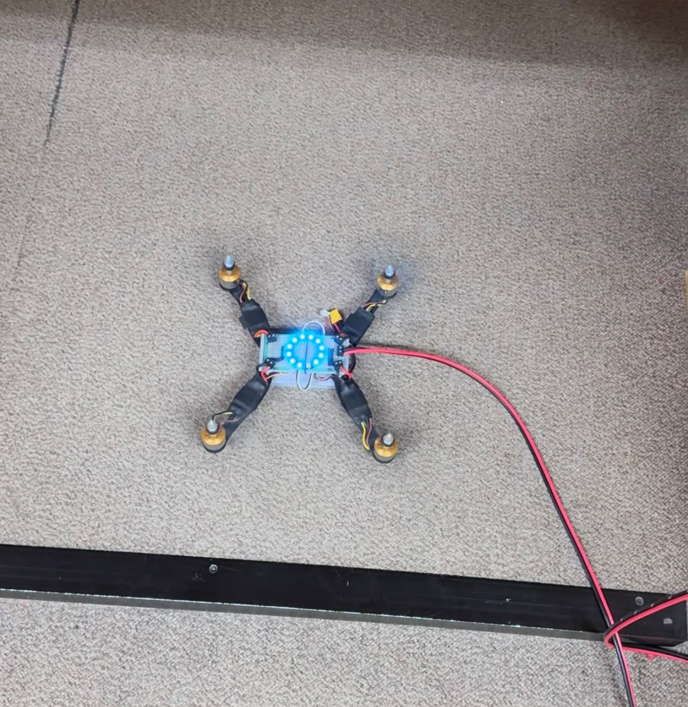
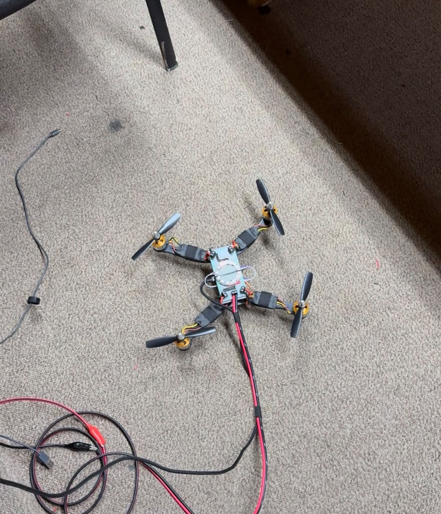
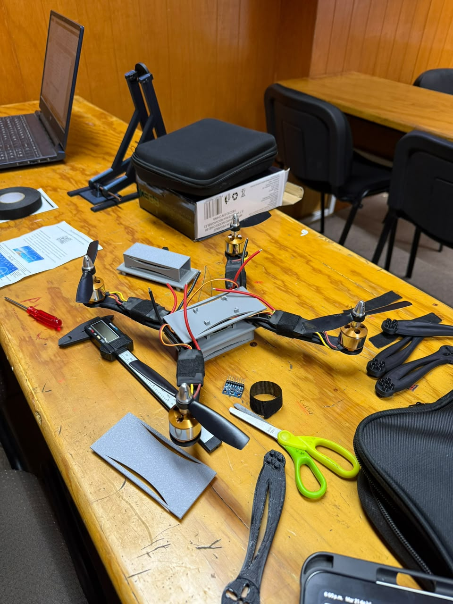
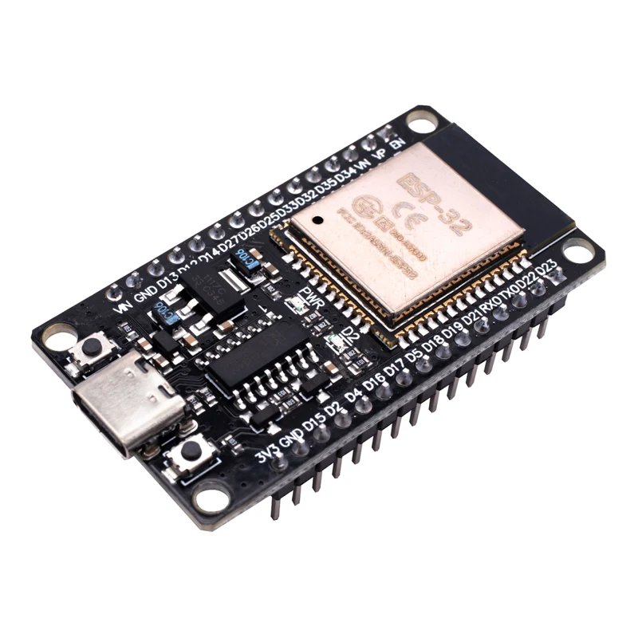
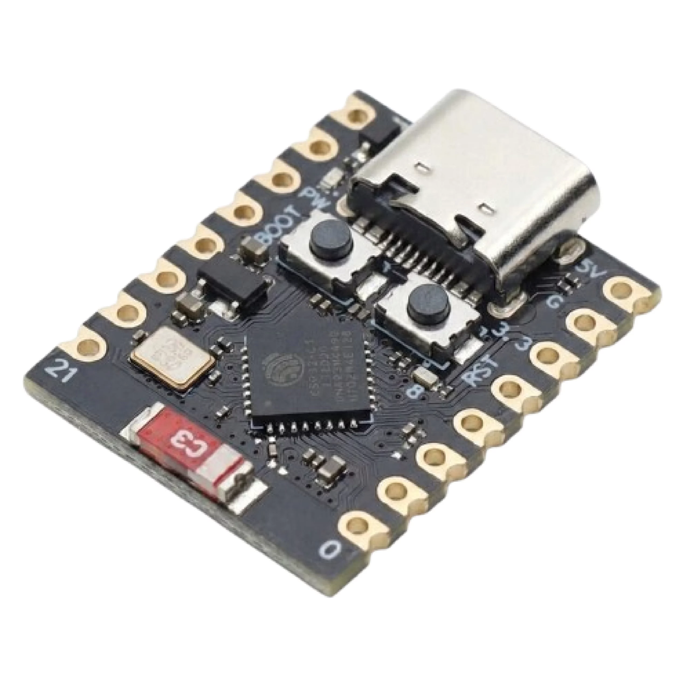
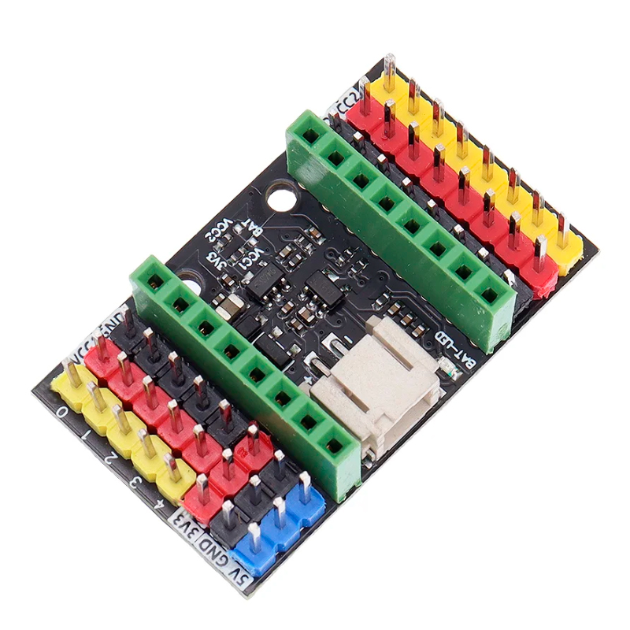
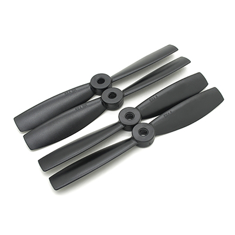
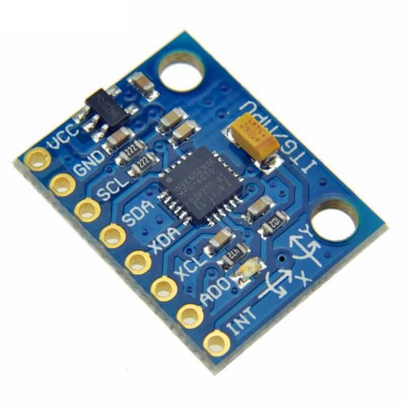
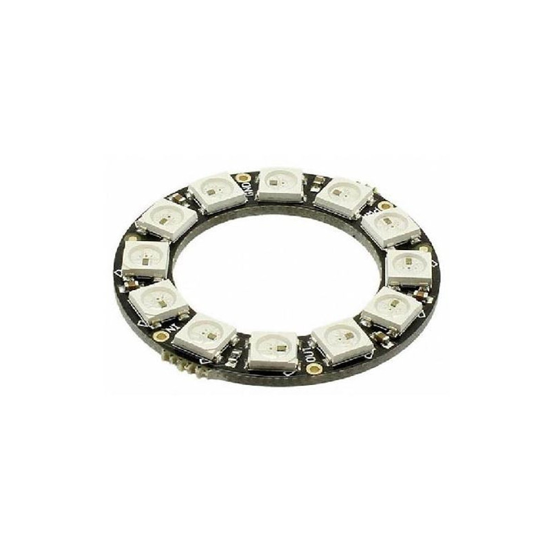

# 🚀 DRL Equipo A

¡Hola! 😁 Somos estudiantes del **Centro de Enseñanza Técnica Industrial (CETI)**, actualmente cursando la asignatura de **Control I**.

<p align="justify">
El objetivo principal de este proyecto es el diseño y construcción de un sistema aéreo no tripulado (dron) desde cero. Para fundamentar el desarrollo y comprender la integración de sus subsistemas, hemos iniciado este proceso mediante la ingeniería inversa de un dron comercial. Este análisis técnico nos ha permitido identificar, documentar y comprender la arquitectura, los componentes electrónicos y los protocolos de comunicación críticos necesarios para el funcionamiento y control de vuelo de un dron.
</p>

## 🛠 Equipo de Gestión y Desarrollo

Este proyecto es posible gracias al trabajo colaborativo del siguiente equipo de ingenieros:

* **Ingeniero Control:** José Eduardo
* **Ingeniero Mecánico:** Héctor Manuel
* **Ingeniero Eléctrico:** Héctor Cruz
* **Ingeniero Software:** José Alberto
* **Ingeniero Comunicaciones:** Darío Ibarra

---

# 📄 Prototipo

<div align="center">
  
  
  
</div>

---

# 🔩 Componentes del Dron

A continuación se documentan los componentes electrónicos y mecánicos utilizados en el desarrollo del prototipo propio.

<table>
  <tr>
    <td align="center" width="250"></td>
    <td>
      <b>ESP32 - Base</b><br>
      <ul>
        <li><b>Modelo:</b> ESP32 DEVKIT V1</li>
        <li><b>Puerto:</b> Micro USB o USB-C (según versión)</li>
        <li><b>Chip USB-Serial:</b> CP2102 (Micro USB) / CH340 (USB-C)</li>
        <li><b>Núcleos:</b> 2 (Tensilica Xtensa 32-bit LX6)</li>
        <li><b>Frecuencia de reloj:</b> hasta 240 MHz</li>
        <li><b>Desempeño:</b> hasta 600 DMIPS</li>
        <li><b>Voltaje de alimentación (USB):</b> 5 V DC</li>
        <li><b>Voltaje de E/S:</b> 3.3 V DC</li>
        <li><b>Consumo en modo suspensión:</b> 5 µA</li>
        <li><b>Pines físicos:</b> 30 (24 GPIO digitales)</li>
        <li><b>ADC:</b> 2 canales de 12 bits (SAR), hasta 18 canales</li>
        <li><b>Conectividad:</b> WiFi 802.11 b/g/n/e/i (150 Mbit/s @ 2.4 GHz) + Bluetooth 4.2 BR/EDR/BLE, antena en PCB</li>
        <li><b>Memoria:</b> 448 KB ROM, 520 KB SRAM, 6 KB SRAM RTC, soporte QSPI multi-chip</li>
        <li><b>Seguridad:</b> IEEE 802.11 (WFA, WPA/WPA2, WAPI), cifrado por hardware AES, SHA-2, RSA, ECC, RNG</li>
        <li><b>Dimensiones:</b> 52 mm x 28.5 mm x 15 mm</li>
        <li><b>Peso:</b> 9 g</li>
      </ul>
    </td>
  </tr>
  <tr>
    <td align="center" width="250"></td>
    <td>
      <b>ESP32 - Aire</b><br>
      <ul>
        <li><b>Modelo:</b> ESP32-C3 Super Mini</li>
        <li><b>Chip:</b> ESP32-C3, 32-bit RISC-V, 160 MHz</li>
        <li><b>Puerto:</b> USB Tipo C</li>
        <li><b>Voltaje de operación:</b> 3 V a 3.6 V</li>
        <li><b>Rango de temperatura:</b> -40° a 85°C</li>
        <li><b>WiFi:</b> IEEE 802.11 b/g/n (2.4 GHz)</li>
        <li><b>Bluetooth:</b> Bluetooth 5, Bluetooth Mesh</li>
        <li><b>Memoria:</b> 384 KB ROM, 400 KB SRAM, 4 MB flash</li>
        <li><b>Periféricos:</b> 1× I2C, 1× SPI, 2× UART, 11× PWM, 4× ADC</li>
        <li><b>Dimensiones:</b> 22.5 mm × 18 mm</li>
        <li><b>Peso:</b> 3.05 g</li>
      </ul>
    </td>
  </tr>
  <tr>
    <td align="center" width="250"></td>
    <td>
      <b>Tarjeta de Expansión</b><br>
      <ul>
        <li><b>Entrada/Fuente:</b> USB Tipo C / Batería de Litio 3.7 V</li>
        <li><b>Voltajes de salida:</b> 5 V y 3.3 V</li>
        <li><b>Voltaje de batería:</b> 3.7 V</li>
        <li><b>Dimensiones:</b> 37.4 mm × 22.7 mm</li>
        <li><b>Peso:</b> 8 g</li>
      </ul>
    </td>
  </tr>
  <tr>
    <td align="center" width="250"></td>
    <td>
      <b>Motor Brushless</b><br>
      <ul>
        <li><b>Modelo:</b> A2212/6 T</li>
        <li><b>Motor KV (RPM / V):</b> KV2200</li>
        <li><b>RPM / V:</b> 2200 KV (2200 revoluciones por minuto por cada volt suministrado)</li>
        <li><b>Voltaje:</b> 7.2 V a 12 V</li>
        <li><b>Corriente:</b> 12 A / 60 s</li>
        <li><b>Eficiencia máxima:</b> 80%</li>
        <li><b>Corriente máxima de eficiencia:</b> 4 ~ 10 A (> 75%)</li>
        <li><b>Corriente sin carga:</b> 10 V / 0.5 A</li>
        <li><b>Tamaño de motor (con eje):</b> 27.5 mm x 38.5 mm</li>
        <li><b>Diámetro del eje:</b> 3.17 mm (3.2 mm)</li>
        <li><b>Longitud del diámetro:</b> 11.5 mm</li>
        <li><b>Peso:</b> 47 g</li>
      </ul>
    </td>
  </tr>
  <tr>
    <td align="center" width="250"></td>
    <td>
      <b>Propela</b><br>
      <ul>
        <li><b>Color:</b> Negro</li>
        <li><b>Orificio de eje:</b> 5 mm</li>
        <li><b>Configuración del paquete:</b> 4 piezas (2 CW / 2 CCW)</li>
        <li><b>Dimensiones:</b> 5 x 4.5"</li>
        <li><b>Peso:</b> 3.8 g c/u</li>
      </ul>
    </td>
  </tr>
  <tr>
    <td align="center" width="250"></td>
    <td>
      <b>ESC</b><br>
      <ul>
        <li><b>Modelo:</b> ESC 30A Driver Motor Brushless</li>
        <li><b>Voltaje de entrada:</b> 2–4 celdas de litio o 5–12 celdas NiCd/NiMH</li>
        <li><b>Corriente continua:</b> 30 A</li>
        <li><b>Corriente máxima (ráfaga):</b> 40 A</li>
        <li><b>Salida BEC:</b> 5 V / 2 A</li>
        <li><b>Frecuencia de trabajo:</b> 50–60 Hz (señal PWM)</li>
        <li><b>RPM máximas soportadas:</b> 210,000 RPM (2 polos), 70,000 RPM (6 polos), 35,000 RPM (12 polos)</li>
        <li><b>Señal de control:</b> PWM estándar (1000–2000 µs)</li>
        <li><b>Tamaño:</b> 57 mm × 25 mm × 8 mm</li>
        <li><b>Peso neto:</b> 27 g</li>
      </ul>
    </td>
  </tr>
  <tr>
    <td align="center" width="250"></td>
    <td>
      <b>Batería</b><br>
      <ul>
        <li><b>Voltaje:</b> 11.1 V</li>
        <li><b>Celdas:</b> 3S</li>
        <li><b>Capacidad de descarga:</b> 30 a 60C</li>
        <li><b>Corriente:</b> 1,400 mAh</li>
        <li><b>Descarga continua:</b> 25C</li>
        <li><b>Tamaño:</b> 85.7 mm x 29.8 mm x 20.2 mm</li>
        <li><b>Peso neto:</b> 125 g</li>
      </ul>
    </td>
  </tr>
  <tr>
    <td align="center" width="250"></td>
    <td>
      <b>Módulo Giroscopio/Acelerómetro</b><br>
      <ul>
        <li><b>Módulo:</b> MPU6050 6 Grados de libertad.</li>
        <li><b>Voltaje de funcionamiento:</b> 3.3 V a 5 V</li>
        <li><b>Chip:</b> MPU-6050</li>
        <li><b>Grados de libertad (DoF):</b> 6</li>
        <li><b>Protocolo de comunicación:</b> I2C</li>
        <li><b>Convertidor analógico a digital:</b> 16 bits en todos los ejes</li>
        <li><b>Rangos:</b>
          <ul>
            <li><b>Giroscopio:</b> ±250, ±500, ±1000 y ±2000 °/s (dps)</li>
            <li><b>Acelerómetro:</b> ±2, ±4, ±8 y ±16 g</li>
          </ul>
        </li>
        <li><b>Dimensiones:</b> 40 mm x 25 mm x 5 mm</li>
        <li><b>Peso:</b> 3 g</li>
      </ul>
    </td>
  </tr>
  <tr>
    <td align="center" width="250"></td>
    <td>
      <b>Iluminación Neopixel</b><br>
      <ul>
        <li><b>Chip controlador:</b> WS2812B</li>
        <li><b>Voltaje de operación:</b> 5 V</li>
        <li><b>Número de LEDs:</b> 12 piezas</li>
        <li><b>Consumo por píxel:</b> 18 mA</li>
        <li><b>Velocidad de transmisión de datos:</b> hasta 800 Kbps</li>
        <li><b>Colores por píxel:</b> 16,777,216 (256 niveles por canal RGB)</li>
        <li><b>Frecuencia de escaneo:</b> ≥ 400 Hz/s</li>
        <li><b>Interfaz:</b> cascada en serie (una línea de señal)</li>
        <li><b>Distancia de transmisión entre puntos:</b> < 5 m sin circuito adicional</li>
        <li><b>Protección:</b> polaridad inversa integrada</li>
        <li><b>Diámetro interior:</b> 35.5 mm</li>
        <li><b>Diámetro exterior:</b> 50 mm</li>
        <li><b>Peso:</b> 6 g</li>
      </ul>
    </td>
  </tr>
</table>

---

## 📄 Planos

A continuación se documentan los planos técnicos utilizados en el desarrollo del prototipo.

<div align="center">

### Plano del Chasis


### Distribución de Componentes


</div>

---

# 🚁 Compilación de Betaflight 4.5.2 para STM32F411 (BlackPill)

**Objetivo:** Compilar un firmware funcional de Betaflight 4.5.2 para una placa de desarrollo genérica STM32F411 (BlackPill) en un entorno Windows utilizando MSYS2, evitando errores de estructura de directorios y dependencias de Python.

---

## 📋 Requisitos Previos
1. Sistema operativo **Windows**.
2. Entorno **MSYS2** instalado.
3. Consola **UCRT64** de MSYS2 abierta. Todo el proceso se realizará exclusivamente en esta terminal.

---

## 🛠️ Paso 1: Preparación del entorno y dependencias
Antes de descargar el código, es necesario asegurar que el sistema cuenta con todas las herramientas necesarias para la compilación y la ejecución de scripts internos.

```bash
# 1. Actualizar el sistema base de MSYS2
pacman -Syu

# 2. Instalar Git, Make, Unzip y Python3
pacman -S git make unzip python3
```

---

## 📥 Paso 2: Descarga del código fuente de Betaflight
Crearemos un directorio de trabajo limpio en la raíz del disco duro y descargaremos la versión exacta del código que vamos a compilar.

```bash
# 1. Navegar a la raíz y crear la carpeta de trabajo
cd /c/
mkdir betaflight
cd betaflight

# 2. Clonar el repositorio oficial (incluyendo submódulos)
git clone --recursive https://github.com/betaflight/betaflight.git betaflight-4.5.2

# 3. Entrar a la carpeta descargada
cd betaflight-4.5.2

# 4. Cambiar a la rama de la versión estable 4.5.2
git checkout -b release-4.5.2 tags/4.5.2
```

---

## ⚙️ Paso 3: Instalación de la cadena de herramientas (ARM SDK)
Betaflight requiere una versión específica del compilador GCC cruzado para arquitecturas ARM. Descargaremos esta herramienta y ajustaremos su directorio.

```bash
# 1. Descargar y extraer el compilador GCC ARM automáticamente
make arm_sdk_install

# 2. Corregir el error de anidación de carpetas (mover archivos un nivel arriba)
mv tools/gcc-arm-none-eabi-10.3-2021.10/gcc-arm-none-eabi-10.3-2021.10/* tools/gcc-arm-none-eabi-10.3-2021.10/

# 3. Añadir el compilador a las variables de entorno (PATH)
export PATH=$PATH:/c/betaflight/betaflight-4.5.2/tools/gcc-arm-none-eabi-10.3-2021.10/bin
```

---

## 📂 Paso 4: Obtención de la configuración personalizada
Para que Betaflight reconozca la placa BlackPill, necesitamos un perfil de hardware (target) que defina los pines y puertos de la STM32F411.

```bash
# 1. Salir momentáneamente a la carpeta principal de trabajo
cd /c/betaflight

# 2. Clonar el repositorio comunitario con la configuración de la placa
git clone https://github.com/anlgncr/custom-betaflight-board.git
```

---

## 🧩 Paso 5: Integración en la estructura de Betaflight 4.5+
A partir de la versión 4.5, el sistema de compilación cambió. Las configuraciones de hardware ya no se ubican en `src/main/target`, sino que utilizan el sistema de configuración unificado.

```bash
# 1. Regresar a la carpeta del código fuente de Betaflight
cd betaflight-4.5.2

# 2. Crear el directorio para configuraciones personalizadas (si no existe)
mkdir -p src/config/configs

# 3. Copiar la configuración de la BlackPill a la nueva ruta
cp -r /c/betaflight/custom-betaflight-board/BLACKPILL src/config/configs/
```

---

## 🚀 Paso 6: Compilación del Firmware
Con el entorno limpio, el compilador configurado y la placa en la ruta correcta, procederemos a compilar.

> ⚠️ **Importante:** En la versión 4.5.2, para compilar configuraciones personalizadas, se debe utilizar el parámetro `CONFIG=` en lugar del antiguo `TARGET=`.

```bash
# 1. Limpiar el entorno de compilaciones o cachés anteriores
make clean

# 2. Iniciar la compilación final para la BlackPill
make CONFIG=BLACKPILL
```

---

## 🎉 Paso 7: Resultados y Flasheo
Si el proceso se realizó correctamente, la terminal finalizará sin errores y mostrará el uso de memoria (FLASH y RAM) del procesador. El archivo compilado listo para ser cargado en la placa se generará en la siguiente ruta:

```
/c/betaflight/betaflight-4.5.2/obj/betaflight_4.5.2_STM32F411_BLACKPILL.hex
```